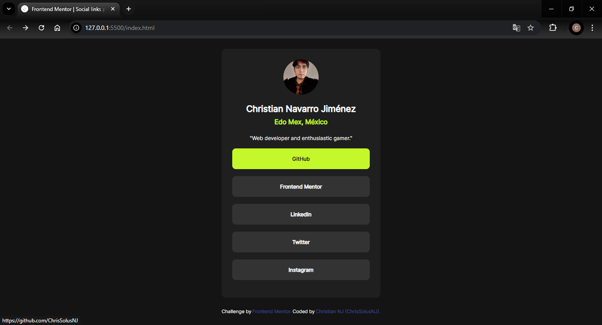
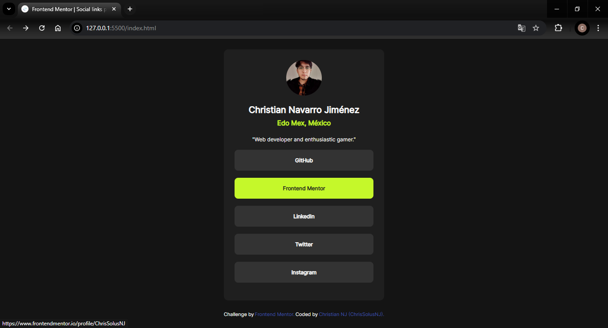

# Frontend Mentor - Social links profile solution

This is a solution to the [Social links profile challenge on Frontend Mentor](https://www.frontendmentor.io/challenges/social-links-profile-UG32l9m6dQ). Frontend Mentor challenges help you improve your coding skills by building realistic projects. 

## Table of contents

- [Overview](#overview)
  - [The challenge](#the-challenge)
  - [Screenshot](#screenshot)
  - [Links](#links)
- [My process](#my-process)
  - [Built with](#built-with)
  - [What I learned](#what-i-learned)
  - [Continued development](#continued-development)
  - [Useful resources](#useful-resources)
- [Author](#author)
- [Acknowledgments](#acknowledgments)

## Overview

### The challenge

Users should be able to:

- See hover and focus states for all interactive elements on the page

### Screenshot

### Links

- Solution URL: [Add solution URL here](https://your-solution-url.com)
- Live Site URL: [Add live site URL here](https://chrissolusnj.github.io/Social-Links-Profile/)

## My process

### Built with

- Semantic HTML5 markup
- CSS custom properties
- Flexbox
- [HTML](https://developer.mozilla.org/es/docs/Web/HTML) - HTML library
- [CSS](https://developer.mozilla.org/en-US/docs/Web/CSS/box-shadow) - Box-shadow CSS

### What I learned

This practice helped me to reinforce some HTML and CSS elements, as well as learn to improve my search for information in official documentation. The most complicated thing for me has been the CSS styles, since there are so many rules and you have to manage so many things (CSS grid and Flexbox to mention two), it becomes quite complex to select the best properties that fit a project.

### Continued development

For future projects I would like to improve more on the CSS rules applied to a web page, improve the responsive design, flexbox and use better units of measurement for the different elements of the page, as well as the colors and customization of the page.

### Useful resources

- [Basic Concepts of Flexbox](https://developer.mozilla.org/en-US/docs/Web/CSS/CSS_flexible_box_layout/Basic_concepts_of_flexbox) - This helped me understand a little better how FlexBox works for this practice.

## Author

- GitHub - [@ChrisSolusNJ](https://github.com/ChrisSolusNJ)
- Frontend Mentor - [@ChrisSolusNJ](https://www.frontendmentor.io/profile/ChrisSolusNJ)
